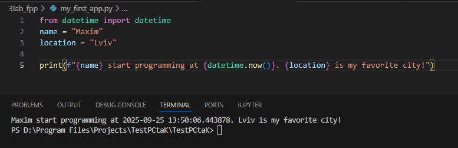
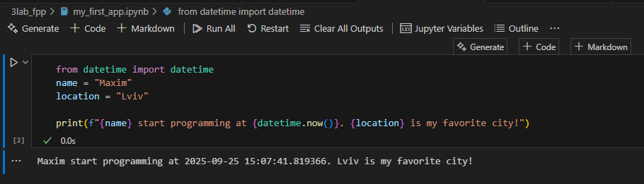
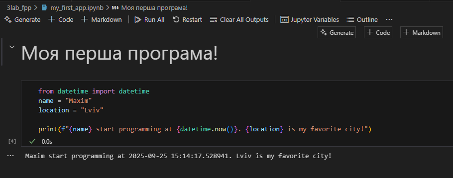

# Звіт до роботи

## Тема
Тема: Вступні заняття: налаштування середовища, прочаток роботи з Python та Markdown;

## Мета роботи
Мета: Налаштувати середовище роботи VS Code, створити репозиторій Github та налаштувати інтеграцію з ним, написати першу програму на Python та створити звіт з використанням форматування Markdown;

---

## Виконання роботи

1. Розробили/Створили першу програму на Python у файлі `my_first_app.py`  

2. Програма вивела значення:  ```Maxim start programming at 2025-09-25 13:50:06.443878. Lviv is my favorite city!```

3. Отримано наступні результати
- успішно налаштоване середовище VS Code 
- встановлені необхідні плагіни (`Python`, `Jupyter`, `Copilot`)
- створено та виконано першу програму у двох форматах (звичайний `.py` файл і `.ipynb` ноутбук)

4. Навчились:  
- налаштовувати робоче середовище VS Code;  
- створювати та запускати Python-програми;  
- працювати з Jupyter Notebook та комірками Markdown;  
- завантажувати файли у GitHub-репозиторій.

---

- Програма вивела



---



---



## Відповідь ChatGPT

**Питання:** яку б першу програму написав АІ та чи б міг АІ пояснити її?  

**Відповідь:**  
Першою програмою, яку написав би АІ, могла б бути класична `Hello, world!`.  
Ця програма символічна: вона показує, що АІ вміє взаємодіяти зі світом через текстовий вивід.  
Також вона проста для пояснення, адже складається лише з одного рядка коду, але при цьому ілюструє базовий принцип програмування — інструкція виконується і породжує результат.  

---

### Код програми (Python):

```python
print("Hello, world!")
